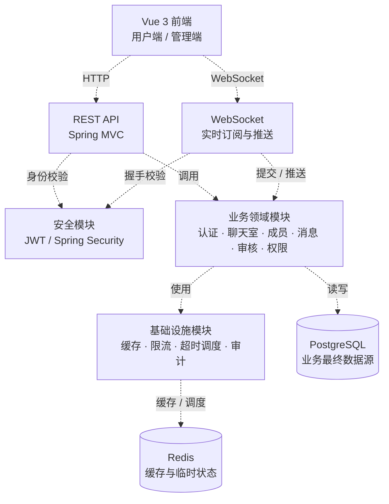
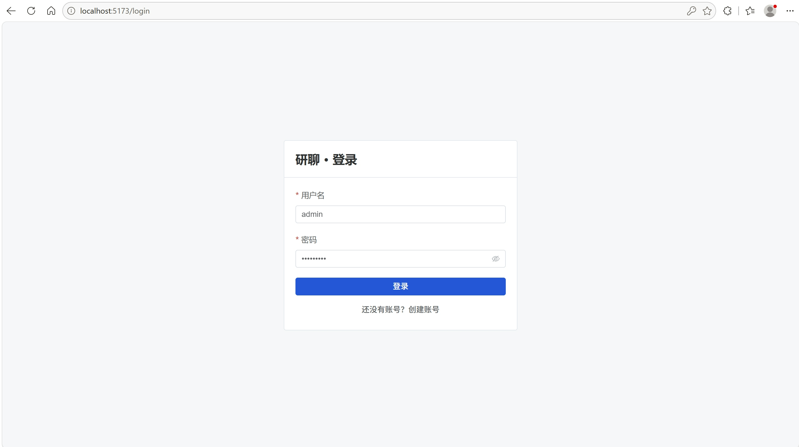
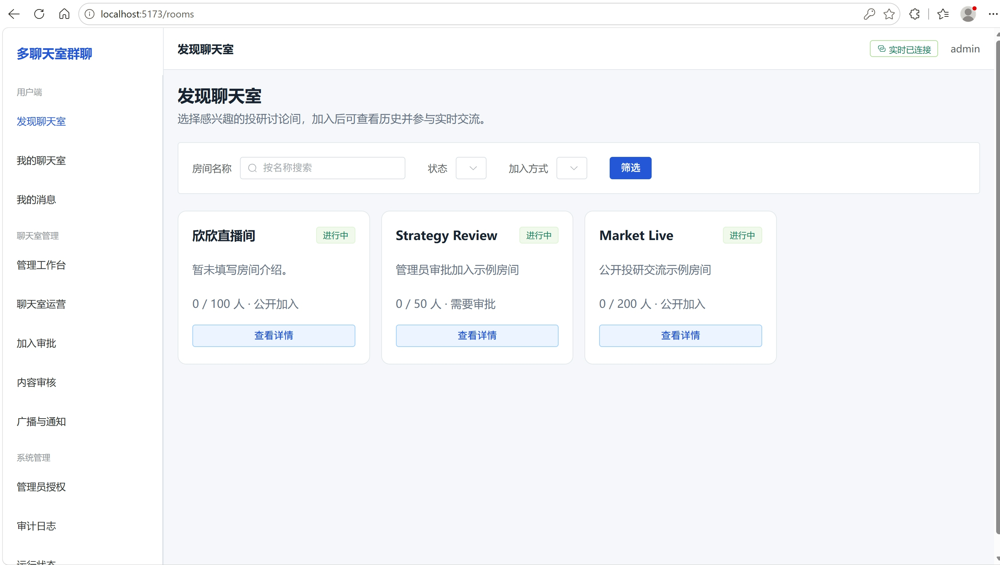
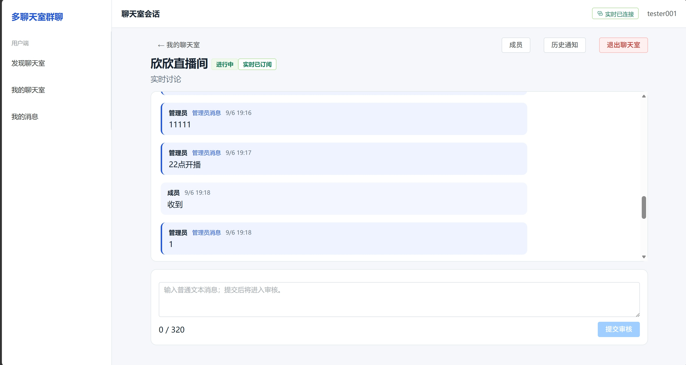
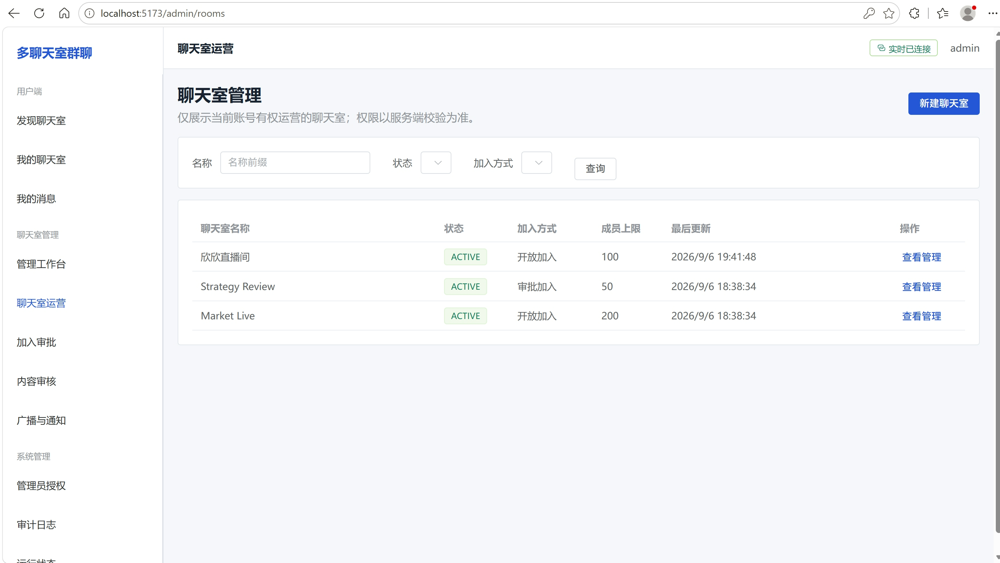
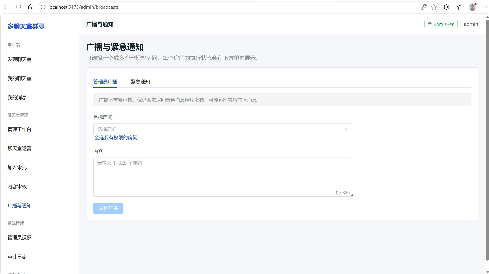
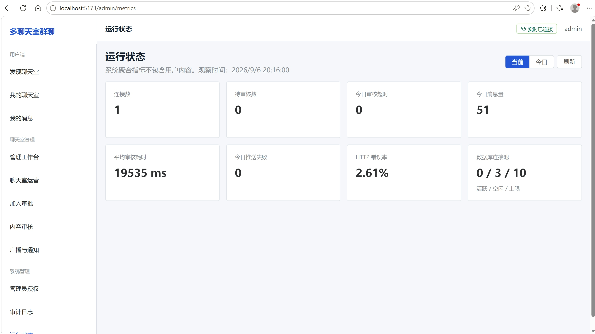

# 多聊天室群聊项目

## 项目架构设计

项目采用前后端分离的模块化单体架构：Vue 3 前端通过 REST API 完成查询与管理操作，通过 WebSocket 接收实时消息；Spring Boot 后端按认证、聊天室、成员、消息审核、权限和实时通信等业务领域拆分。PostgreSQL 保存全部业务最终状态，Redis 仅承载缓存和临时运行状态。



### 模块划分

| 模块 | 主要职责 | 对应目录 |
| --- | --- | --- |
| 前端 | 登录、聊天室浏览与会话、个人中心、管理员运营页面 | `frontend/src` |
| `auth` | 用户注册、登录、令牌签发与当前用户信息 | `src/main/java/com/multichat/auth` |
| `security` | JWT 校验、Spring Security 配置和访问控制 | `src/main/java/com/multichat/security` |
| `room` | 聊天室创建、查询、更新、关闭与删除 | `src/main/java/com/multichat/room` |
| `member` | 加入申请、成员审批、退出和我的聊天室 | `src/main/java/com/multichat/member` |
| `message` | 消息提交、审核、发布、历史查询、超时与推送补偿 | `src/main/java/com/multichat/message` |
| `permission` | 系统管理员与房间管理员的授权范围管理 | `src/main/java/com/multichat/permission` |
| `websocket` | JWT 握手、单连接多房间订阅、会话管理与消息通知 | `src/main/java/com/multichat/websocket` |
| `infrastructure/redis` | 房间缓存、在线状态、消息限流、待审核索引与恢复 | `src/main/java/com/multichat/infrastructure/redis` |
| `common`、`audit` | 统一响应、异常处理、请求链路、业务日志与审计 | `src/main/java/com/multichat/common`、`src/main/java/com/multichat/audit` |

### 关键设计约束

- PostgreSQL 是用户、聊天室、成员关系、消息、授权和审计日志的唯一最终数据源。
- Redis 不保存完整消息正文，仅用于缓存、在线状态、限流以及待审核消息的超时调度。
- 一名用户使用一条 WebSocket 连接订阅多个聊天室；订阅时会重新校验成员资格。
- 普通聊天消息先进入 `PENDING_REVIEW`；审核通过后推送并最终标记为 `PUBLISHED`。管理员消息和紧急通知可按权限直接发布。
- 审核状态变更与审计日志在同一数据库事务中完成；发布失败的已审核消息由补偿任务再次推送。

## 项目截图

### 登录页面



### 聊天室列表



### 聊天室会话



### 聊天室运营



### 广播与通知



### 运行状态



## 环境要求

- Java：17
- Maven：3.9.7
- PostgreSQL：14 或更高版本
- Redis：6.2 或更高版本，本地不设置密码
- Node.js：18 或更高版本，建议使用 Node.js 20 LTS

## 数据库初始化

初始化 SQL 文件位于 `sql/migrations` 目录；项目实际启动时由 Flyway 执行 `src/main/resources/db/migration` 目录中的同版本迁移脚本。

首次启动前请先在 PostgreSQL 中创建配置文件指定的数据库。项目启动后会自动执行数据库迁移，并创建所需的数据表和初始化数据，无需手动执行建表 SQL。

## 启动步骤

1. 修改 `src/main/resources/application-dev.yml` 中的 PostgreSQL 配置：

   ```yaml
   spring:
     datasource:
       url: jdbc:postgresql://localhost:5432/postgres
       username: postgres
       password: 你的PostgreSQL密码
   ```

2. 启动 Redis，保持默认无密码配置。

3. 在 IDE 中运行后端启动类 `MultiRoomChatApplication.java`。

4. 打开终端并启动前端：

   ```powershell
   cd frontend
   npm install
   npm run dev
   ```

5. 在浏览器打开终端显示的前端地址，通常为 `http://localhost:5173`。

## 普通用户注册

在登录页面点击“还没有账号？创建账号”，填写用户名、邮箱和密码后，点击“注册并登录”即可创建普通用户账号并自动登录。

- 用户名：3 至 32 个字符，只能包含字母、数字、下划线或连字符。
- 邮箱：有效邮箱地址，最长 254 个字符。
- 密码：8 至 72 个字符。

## 默认账号

初始管理员账号：`admin` / `Admin123!`。

## ER 关系表

| 实体 | 关联实体 | 基数 | 关系说明 |
| --- | --- | --- | --- |
| `users` | `chat_rooms` | 1 : N | 用户可创建多个聊天室，`chat_rooms.created_by` 指向创建者。 |
| `users` | `user_chat_rooms` | 1 : N | 用户可拥有多个聊天室成员关系。 |
| `chat_rooms` | `user_chat_rooms` | 1 : N | 聊天室可包含多个成员关系记录。 |
| `users` | `messages` | 1 : N | 用户可发送多条消息，`messages.sender_id` 指向发送者。 |
| `chat_rooms` | `messages` | 1 : N | 聊天室内按 `room_seq` 保存多条消息。 |
| `users` | `admin_room_permissions` | 1 : N | 管理员可获得多个聊天室的管理授权。 |
| `chat_rooms` | `admin_room_permissions` | 1 : N | 聊天室可被授权给多个房间管理员。 |
| `users` | `audit_logs` | 1 : N | 用户发起的关键操作写入审计日志，`audit_logs.actor_id` 可为空。 |
| `messages` | `audit_logs` | 1 : N | 一条消息可对应提交、审核、超时等多条审计记录。 |
| `user_chat_rooms` | `audit_logs` | 1 : N | 加入、审批和退出等成员关系变更可被审计。 |
